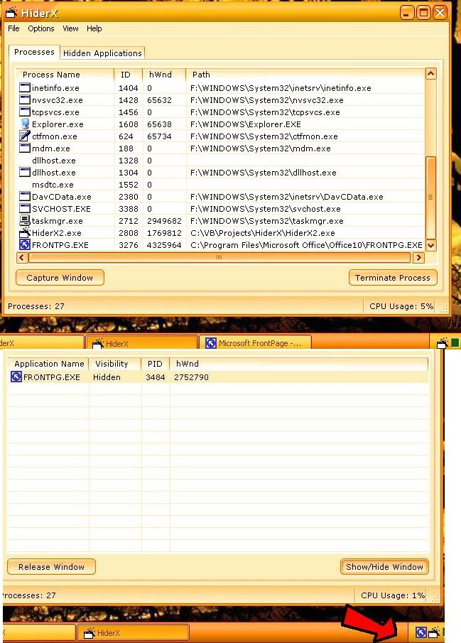



## HiderX v2

### Description

I finally moved my lame hands to make this. HiderX 2 is here. Now it can handle unlimited windows at a time. If you dont have a clue what im talking about then listen: HiderX can make any application/window on the desktop and hide it to system tray. That way you can have much more space on your desktop and minimize the programs to tray which you are not currently working on. This new version is more like the Task Manager of WinXP/2K. Well I think this program will also work on Win98 but i dont expect the icons will appear properly. Ill work on that later. So.. its like the Task Manager; you just select any window and Capture it. Its icon appears on the tray and then you can minimize it, show it, quit the program, etc. Some bugs are there, i know.. i really dont have time to finish this thing.
 
### More Info
 

             |
---                |---
**Submitted On**   |
**By**             |[Faraz Azhar](https://github.com/Planet-Source-Code/PSCIndex/blob/master/ByAuthor/faraz-azhar.md)
**Level**          |Advanced
**User Rating**    |5.0 (15 globes from 3 users)
**Compatibility**  |VB 6\.0
**Category**       |[Windows API Call/ Explanation](https://github.com/Planet-Source-Code/PSCIndex/blob/master/ByCategory/windows-api-call-explanation__1-39.md)
**World**          |[Visual Basic](https://github.com/Planet-Source-Code/PSCIndex/blob/master/ByWorld/visual-basic.md)
**Archive File**   |

### Source Code

Im having some trouble uploading my code, i guess pscode has seen enough of the war :).. please download it from here: www.geocities.com/farazazhar_net/ and go to All Projects in VB section.

